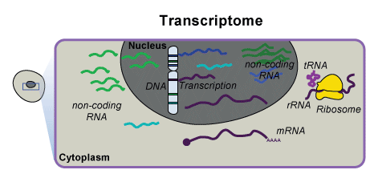
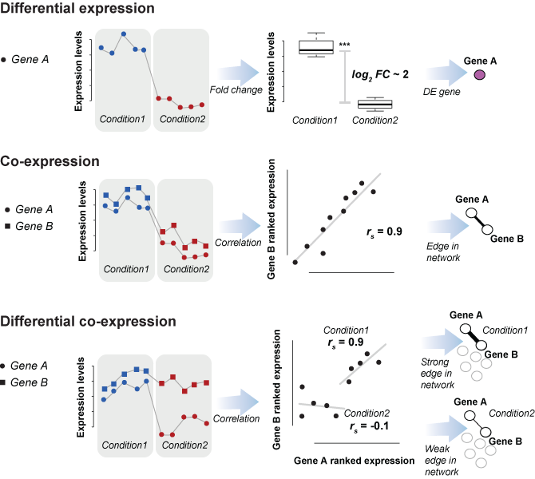
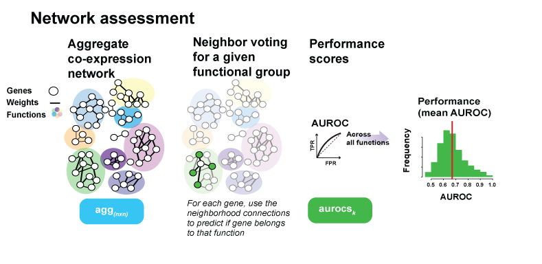
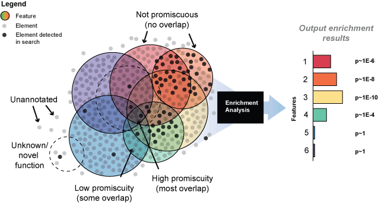
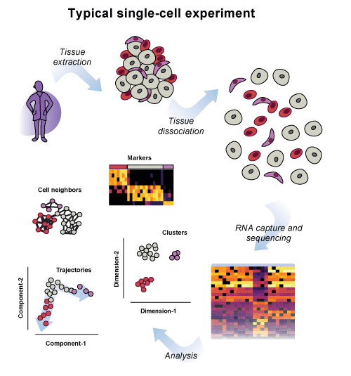

# On-boarding

Hello and welcome! 
This document is a collection of the steps to get setup in the lab, along with some useful tools and tasks that the lab is interested in. For a collection of How-to's, see [here](https://sarbal.github.io/howdoI). Lab reading background can be found [here](https://gillislab.github.io/background/) and publications [here](https://gillislab.github.io/publications/). 

# Getting started
1. Setup your CSHL account (this is given to you in your starting package).
2. Go to the IT [portal](https://jira.cshl.edu/) and request access to the wiki/confluence. 
3. Join the Gillis lab slack [channel](https://gillislab.slack.com) and say hi!
4. Make sure you can connect to the servers listed below. PuTTy, cygwin etc.  
5. Setup VPN on your laptop or home computer. 

## Gillis lab sites 
- Lab website: [http://gillislab.labsites.cshl.edu](http://gillislab.labsites.cshl.edu)
- Slack: [https://gillislab.slack.com](https://gillislab.slack.com)
- Github: [https://github.com/gillislab/](https://github.com/gillislab/)

## CSHL sites 
- Intranet: [http://intranet.cshl.edu/](http://intranet.cshl.edu/)
- CSHL email: [https://email.cshl.edu/](https://email.cshl.edu/)
- IT portal:  [https://jira.cshl.edu/](https://jira.cshl.edu/)
- Wiki/confluence: [https://wiki.cshl.edu](https://wiki.cshl.edu)
- Leading strand (meetings videos):	[http://leadingstrand.cshl.edu/](http://leadingstrand.cshl.edu/) 
- Library:	[http://library.cshl.edu/](http://library.cshl.edu/)
- Meetings and courses [http://intranet.cshl.edu/education/meetings-courses/meetings-a-courses](http://intranet.cshl.edu/education/meetings-courses/meetings-a-courses)
- Labwide calendar:	[http://intranetv2.cshl.edu/calendar/](http://intranetv2.cshl.edu/calendar/)

## Servers
These are the local servers that can only be accessed within the lab (or through a VPN). 
### Local servers
- dactyl.cshl.edu
- tyrone.cshl.edu
- rugen<1-6>.cshl.edu

### Web server
- milton.cshl.edu

### HPCC 
Also known as Black and Blue, bnb, "the cluster". There are two development nodes.  
- bnbdev1.cshl.edu
- bnbdev2.cshl.edu
- filezone1.cshl.edu

# What do we do? 
Our work centers on characterizing gene networks to understand gene function, cell identity and disease.  We particularly focus on gene networks derived from expression data through the combination of hundreds or thousands of experiments. Some of the issues surrounding network analysis are discussed in this opinion [piece](https://f1000research.com/articles/1-14/v1). 

# Gene function prediction
An important focus (and challenge) in functional genomics is gene function prediction. 

## Guilt-by-association 
The guilt by association principle states that genes with similar functions will tend to possess similar properties. This allows previously unknown functions of a gene to be statistically inferred given some prior knowledge about other genes. 

1. *A set of candidate genes*: 
All genes in the genome or a more focused set such as those in a candidate genetic locus.

2. *One or more target gene groups of interest*:
Typically defined around a function, such as those from the Gene Ontology (GO).

3. *Data with associations or similarities among the target and candidate genes*:
These data are often represented or thought of as a network, and can include coexpression, protein interactions, genetic interactions, sequence simlarities, phylogenetic profiles, and phenotype and disease association profiles.

4. *An algorithm*:
This is to transfer (or infer) functional labels from the target genes to the previously unlabeled candidate genes.

## Differential expression, co-expression and differential co-expression
The transcriptome is all the RNA molecules expressed from the genes of an organism.

Generally, three approaches are taken to analyse transcriptional data which include differential expression, co-expression and differential co-expression.

Co-expression is meant to reflect co-regulation, co-functionality and co-variation. We have shown the utility of co-expression, in particular meta-analytic co-expression, in a variety of applications.

## Neighbor-voting 
 

## Multifunctionality 
Gene multifunctionality is a pervasive bias in functional genomics. Our work has focused on evaluating how this bias impacts the generation of biologically non-specific results as well as highly fragile significances in a variety of fields.

# Databases and repositories  
## Gene expression data
### Databases  
[GEO](https://www.ncbi.nlm.nih.gov/geo/) 

[SRA](https://www.ncbi.nlm.nih.gov/sra) and human metadata at [metaSRA](http://metasra.biostat.wisc.edu/).

[ArrayExpress](https://www.ebi.ac.uk/arrayexpress/)

[ENA](https://www.ebi.ac.uk/ena)

[Single Cell Expression Atlas](https://www.ebi.ac.uk/gxa/sc/home)

[Expression Atlas](https://www.ebi.ac.uk/gxa/home)

[Allen Brain Atlas](https://portal.brain-map.org/)

### Processed expression data 
[Recount2](https://jhubiostatistics.shinyapps.io/recount/) 

[GEMMA](https://gemma.msl.ubc.ca/)

[ARCHS4](https://amp.pharm.mssm.edu/archs4/)

[Biojupies](https://amp.pharm.mssm.edu/biojupies/). 
 
### Core datasets 
[GTEx](https://gtexportal.org/home/)

[GEUVADIS](https://www.ebi.ac.uk/Tools/geuvadis-das/)

[ENCODE](https://www.encodeproject.org/) 

[BrainSpan](https://www.brainspan.org/) 

### Co-expression databases 
[COEXPRESdb](https://coxpresdb.jp/)

[HumanBase](https://hb.flatironinstitute.org/)

## Genomic data and annotations
[ENSEMBL](http://useast.ensembl.org/index.html). Note, contains data on [multiple species](http://useast.ensembl.org/info/about/species.html). 

[GENCODE](https://www.gencodegenes.org/), specifically [human](https://www.gencodegenes.org/human/) and [mouse](https://www.gencodegenes.org/mouse/). But [modENCODE (for fly and worm)](http://www.modencode.org/). 

Other types of data (such as sequence, protein, gene IDs) can be accessed from [NCBI refseq](https://www.ncbi.nlm.nih.gov/refseq/) through their [ftp](ftp://ftp.ncbi.nlm.nih.gov/refseq/release/). 

## Ontologies
Ontologies have vocabularies (term -> term) and annotation (gene -> term) relationships. Some useful and key ontologies:  
[Gene Ontology](http://geneontology.org/) 
Related [work](https://www.ncbi.nlm.nih.gov/pmc/articles/PMC5389513/). 

[Human phenotype ontology (HPO)](https://hpo.jax.org/app/)

[Cell ontologies](http://www.obofoundry.org/ontology/cl.html)

[Experimental factor (EFO)](https://www.ebi.ac.uk/efo/)

Others (and data) can be found here at the [Harmonizome](https://amp.pharm.mssm.edu/Harmonizome/). 
The [OBO foundry](https://github.com/OBOFoundry/purl.obolibrary.org/) has the standard vocabularies. 

## Pathways 
[KEGG](https://www.genome.jp/kegg/)

[Reactome](https://reactome.org/)

[Biocarta](https://amp.pharm.mssm.edu/Harmonizome/dataset/Biocarta+Pathways). The original site seems to be dead/down. 

## Protein data 
[biogrid](https://thebiogrid.org/) 

[STRING](https://string-db.org/)

[I2D](http://ophid.utoronto.ca/ophidv2.204/) 

[HIPPIE](http://cbdm-01.zdv.uni-mainz.de/~mschaefer/hippie/)

[Interpro](https://www.ebi.ac.uk/interpro/)

[HuRI (human reference or CCSB)](http://interactome.baderlab.org/download)

[Human Protein Atlas](https://www.proteinatlas.org/)

## Variant data
[1000 genomes](https://www.internationalgenome.org/)

[ExAC](http://exac.broadinstitute.org/)

[gnoMAD](https://gnomad.broadinstitute.org/)

[TOPmed](https://www.nhlbiwgs.org/) which can also be accessed [here](https://bravo.sph.umich.edu/freeze5/hg38/). 

[dbGAP](https://www.ncbi.nlm.nih.gov/gap/)

# Tools and techniques
## Microarray

Notes [here](https://wiki.bits.vib.be/index.php/Analyze_your_own_microarray_data_in_R/Bioconductor) 

## RNA-sequencing 
Some useful notes [here](https://bioinformatics-core-shared-training.github.io/RNAseq-R/) and [here](https://www.bioconductor.org/packages/devel/workflows/vignettes/rnaseqGene/inst/doc/rnaseqGene.html)

### Bulk 
List of tools [here](https://en.wikipedia.org/wiki/List_of_RNA-Seq_bioinformatics_tools) 
And some others like [fastX](http://hannonlab.cshl.edu/fastx_toolkit/) and [fastQC](https://www.bioinformatics.babraham.ac.uk/projects/fastqc/) are good for QC. 

### Single-cell 
List of all tools [here](https://www.scrna-tools.org). Some key tools include [Seurat](https://satijalab.org/seurat/) and []. Comprehensive tutorials like [Hemberg lab's course](https://scrnaseq-course.cog.sanger.ac.uk/website/index.html) are particulary useful. 

### Alignment tools 

https://sarbal.github.io/howdoI/workflows/howtos_alignment.html

#### STAR
Github [here](https://github.com/alexdobin/STAR) and [manual](https://github.com/alexdobin/STAR/blob/master/doc/STARmanual.pdf). 
Reference [here](https://www.ncbi.nlm.nih.gov/pmc/articles/PMC3530905/) and [here](https://www.ncbi.nlm.nih.gov/pmc/articles/PMC4631051/).

#### Kallisto
Github [here](https://pachterlab.github.io/kallisto/) and [tutorial](https://pachterlab.github.io/kallisto/starting). 
Reference [here](https://www.nature.com/articles/nbt.3519). 

#### Salmon
Github [here](https://combine-lab.github.io/salmon/) and [manual](https://combine-lab.github.io/salmon/getting_started/). 
Reference [here](https://www.nature.com/articles/nmeth.4197). The single cell version (Alevin) can be found [here](https://salmon.readthedocs.io/en/latest/alevin.html) and [ref](https://genomebiology.biomedcentral.com/articles/10.1186/s13059-019-1670-y). 

#### Bowtie2
[Source](http://bowtie-bio.sourceforge.net/bowtie2/index.shtml) and [manual](http://bowtie-bio.sourceforge.net/bowtie2/manual.shtml). 
References [here](https://academic.oup.com/bioinformatics/article/35/3/421/5055585), [here](https://www.nature.com/articles/nmeth.1923) and [here](https://genomebiology.biomedcentral.com/articles/10.1186/gb-2009-10-3-r25). 

## Gene set enrichment tools 
[ermineJ](https://erminej.msl.ubc.ca/) 

[GSEA](http://software.broadinstitute.org/gsea/index.jsp)

[DAVID](https://david.ncifcrf.gov/) 

[GEO2Enrichr](https://amp.pharm.mssm.edu/g2e/)

## Genomic tools
[GATK](https://software.broadinstitute.org/gatk/). Also see best practices [workflows](https://software.broadinstitute.org/gatk/best-practices/).

[Samtools](http://www.htslib.org/) 

[BEDtools](https://bedtools.readthedocs.io/en/latest/)

[Tabix](http://www.htslib.org/doc/tabix.html)

[IGVtools](https://software.broadinstitute.org/software/igv/igvtools)
 
UCSC [tools](https://genome.ucsc.edu/util.html). This also hosts genomic data of interest (like cross species alignments).

# Model organisms 
## Orthology 
[Homologene](https://www.ncbi.nlm.nih.gov/homologene)

[OrthoDB](https://www.orthodb.org/)

[BUSCO genes](https://busco.ezlab.org/) 

## Species of interest  
- Mouse (Mus musculus, 10090) at [JAX](http://www.informatics.jax.org/)
- Yeast	(Saccharomyces cerevisiae,4932) at [yeastgenome](https://www.yeastgenome.org/) or (Schizosaccharomyces pombe, 284812) at [pombase](https://www.pombase.org/)
- Fly	(Drosophila melanogaster,7227)	at [flybase](https://flybase.org/) 
- Maize	(Zea mays, 4577) at [maizegdb](https://www.maizegdb.org/), [gramene](http://www.gramene.org/), or at [ensembl](https://plants.ensembl.org/Zea_mays/Info/Index) 
- Arabidopsis	(Arabidopsis thaliana, 3702) [here](https://www.arabidopsis.org/) or [AtGDB](http://www.plantgdb.org/AtGDB/)
- Worm (Caenorhabditis elegans,6239) at [wormbase](https://www.wormbase.org/)
- Zebrafish (Danio rerio, 7955) at [zfin](https://zfin.org/)
- Frog (Xenopus laevis, 8355) at [xenbase](http://www.xenbase.org/entry/)
- Armadillo	(Dasypus novemcinctus,9361) at [here](http://www.xenarthrans.org/) and [ensembl]().
- Naked mole rats	(Heterocephalus glaber, 10181) at [here](http://www.naked-mole-rat.org/)

# Other 
## Gene function prediction competitions 
[CAFA](https://www.biofunctionprediction.org/cafa/) 

[DREAM](http://dreamchallenges.org/)

## Meta-science 
[Meta-research collection](https://collections.plos.org/s/meta-research)

